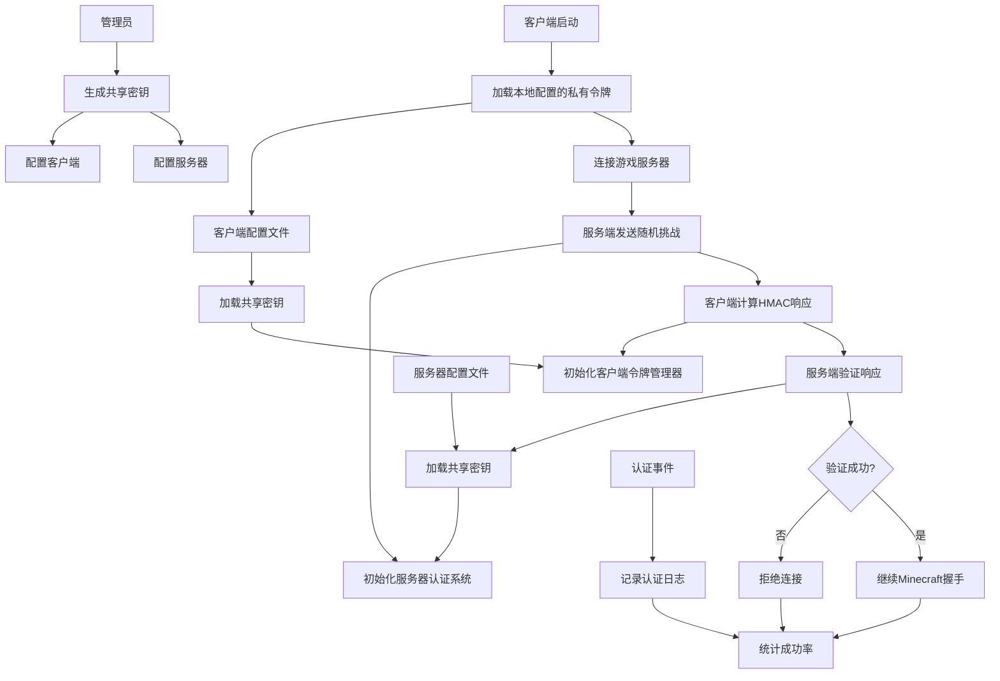

# Minecraft 1.19.2 Fabric 动态令牌认证模组开发指南

## 🎯 项目概述
开发一个基于HMAC-SHA256的动态令牌认证系统，为Minecraft 1.19.2 Fabric服务器提供增强的安全保护，使用静态配置的共享密钥方案。

## 📊 系统架构逻辑图



## 📁 项目结构规划
```
token-auth-mod/
├── src/main/
│   ├── java/com/example/tokenauth/
│   │   ├── TokenAuthMod.java              # 主入口类
│   │   ├── config/                        # 配置管理
│   │   │   ├── ModConfig.java
│   │   │   ├── ConfigManager.java
│   │   │   └── KeyGenerator.java
│   │   ├── crypto/                        # 加密相关
│   │   │   ├── DynamicTokenGenerator.java
│   │   │   └── TokenValidator.java
│   │   ├── network/                       # 网络通信
│   │   │   ├── AuthPacketHandler.java
│   │   │   ├── PacketRegistry.java
│   │   │   └── packets/
│   │   │       ├── ChallengePacket.java
│   │   │       └── TokenResponsePacket.java
│   │   ├── server/                        # 服务端逻辑
│   │   │   ├── AuthSessionManager.java
│   │   │   ├── ConnectionInterceptor.java
│   │   │   ├── commands/
│   │   │   │   └── TokenCommand.java
│   │   │   └── events/
│   │   │       └── AuthEventHandler.java
│   │   ├── client/                        # 客户端逻辑
│   │   │   ├── ClientTokenManager.java
│   │   │   └── ClientPacketHandler.java
│   │   └── util/                          # 工具类
│   │       ├── CryptoUtil.java
│   │       └── NetworkUtil.java
│   └── resources/
│       ├── fabric.mod.json
│       ├── token-auth.mixins.json
│       └── config/
│           └── token-auth-server.toml
│           └── token-auth-client.toml
```

## 🔧 详细开发任务

### [核心模块实现]
1. **主模组类 (TokenAuthMod.java)**
   ```java
   public class TokenAuthMod implements ModInitializer {
       private static TokenAuthMod INSTANCE;
       private ConfigManager configManager;
       
       @Override
       public void onInitialize() {
           INSTANCE = this;
           configManager = new ConfigManager();
           
           // 根据环境初始化
           if (FabricLoader.getInstance().getEnvironmentType() == EnvType.SERVER) {
               initializeServer();
           } else {
               initializeClient();
           }
       }
       
       private void initializeServer() {
           // 注册服务器端组件
           AuthSessionManager.initialize();
           PacketRegistry.registerServerPackets();
           CommandRegistry.registerServerCommands();
       }
       
       private void initializeClient() {
           // 注册客户端组件
           ClientTokenManager.initialize();
           PacketRegistry.registerClientPackets();
       }
   }
   ```

### [配置系统]
1. **服务器配置 (token-auth-server.toml)**
   ```toml
   [authentication]
   enabled = true
   sharedSecret = "base64_encoded_shared_secret_here"
   timeWindow = 30000
   challengeSize = 16
   responseTimeout = 5000
   
   [security]
   maxAttemptsPerIP = 5
   blockDurationMinutes = 30
   enableIPWhitelist = false
   
   [logging]
   enableAuthLogging = true
   logSuccessfulAuth = true
   logFailedAttempts = true
   ```

2. **客户端配置 (token-auth-client.toml)**
   ```toml
   [authentication]
   sharedSecret = "base64_encoded_shared_secret_here"
   autoRefresh = false
   
   [connection]
   timeout = 10000
   retryAttempts = 3
   ```

3. **配置管理器**
   ```java
   public class ConfigManager {
       private ModConfig serverConfig;
       private ModConfig clientConfig;
       
       public void loadServerConfig() {
           serverConfig = loadConfig("token-auth-server.toml", ModConfig.SERVER_DEFAULTS);
       }
       
       public void loadClientConfig() {
           clientConfig = loadConfig("token-auth-client.toml", ModConfig.CLIENT_DEFAULTS);
       }
   }
   ```

### [网络协议实现]
1. **数据包定义**
   ```java
   public class ChallengePacket implements CustomPayload {
       public static final PacketType<ChallengePacket> TYPE = 
           PacketType.create(new Identifier("tokenauth", "challenge"), ChallengePacket::new);
       
       private final byte[] challenge;
       private final long timestamp;
       
       public ChallengePacket(byte[] challenge, long timestamp) {
           this.challenge = challenge;
           this.timestamp = timestamp;
       }
       
       public void write(PacketByteBuf buf) {
           buf.writeByteArray(challenge);
           buf.writeLong(timestamp);
       }
   }
   ```

2. **包处理器**
   ```java
   public class AuthPacketHandler {
       public static void handleChallengeResponse(ChallengePacket packet, 
                                                ServerPlayerEntity player, 
                                                PacketSender responseSender) {
           // 处理客户端响应
           AuthSessionManager.verifyResponse(player, packet);
       }
   }
   ```

### [认证逻辑核心]
1. **令牌生成器**
   ```java
   public class DynamicTokenGenerator {
       private final byte[] sharedSecret;
       
       public DynamicTokenGenerator(byte[] sharedSecret) {
           this.sharedSecret = sharedSecret;
       }
       
       public byte[] generateToken(byte[] challenge, long timestamp) {
           try {
               // 使用时间窗口（默认30秒）
               long timeWindow = timestamp / TimeUnit.SECONDS.toMillis(30);
               
               Mac hmac = Mac.getInstance("HmacSHA256");
               hmac.init(new SecretKeySpec(sharedSecret, "HmacSHA256"));
               
               ByteBuffer buffer = ByteBuffer.allocate(challenge.length + 8);
               buffer.put(challenge);
               buffer.putLong(timeWindow);
               
               return hmac.doFinal(buffer.array());
           } catch (Exception e) {
               throw new RuntimeException("令牌生成失败", e);
           }
       }
   }
   ```

2. **会话管理器**
   ```java
   public class AuthSessionManager {
       private static final Map<String, AuthSession> activeSessions = new ConcurrentHashMap<>();
       private static final ScheduledExecutorService scheduler = Executors.newScheduledThreadPool(1);
       
       public static void initialize() {
           // 启动会话清理任务
           scheduler.scheduleAtFixedRate(AuthSessionManager::cleanupExpiredSessions, 
                                       1, 1, TimeUnit.MINUTES);
       }
       
       public static AuthSession createSession(String connectionId, InetAddress address) {
           byte[] challenge = CryptoUtil.generateRandomBytes(16);
           long timestamp = System.currentTimeMillis();
           
           AuthSession session = new AuthSession(challenge, timestamp, address);
           activeSessions.put(connectionId, session);
           
           // 设置超时清理
           scheduleSessionTimeout(connectionId);
           return session;
       }
   }
   ```

### [混入注入]
1. **服务器登录处理器混入**
   ```java
   @Mixin(ServerLoginNetworkHandler.class)
   public class ServerLoginNetworkHandlerMixin {
       @Inject(method = "onHello", at = @At("HEAD"), cancellable = true)
       private void onHello(LoginHelloC2SPacket packet, CallbackInfo ci) {
           if (TokenAuthMod.getConfig().isAuthenticationEnabled()) {
               // 开始令牌认证流程
               startTokenAuthentication((ServerLoginNetworkHandler) (Object) this, packet);
               ci.cancel();
           }
       }
   }
   ```

### [客户端实现]
1. **客户端令牌管理器**
   ```java
   public class ClientTokenManager {
       private static DynamicTokenGenerator tokenGenerator;
       private static byte[] sharedSecret;
       
       public static void initialize() {
           sharedSecret = TokenAuthMod.getConfig().getClientSharedSecret();
           tokenGenerator = new DynamicTokenGenerator(sharedSecret);
       }
       
       public static void handleServerChallenge(ChallengePacket packet) {
           byte[] response = tokenGenerator.generateToken(packet.getChallenge(), packet.getTimestamp());
           
           // 发送响应给服务器
           ClientPlayNetworking.send(new TokenResponsePacket(response));
       }
   }
   ```

### [管理命令]
1. **令牌管理命令**
   ```java
   public class TokenCommand {
       public static void register(CommandDispatcher<ServerCommandSource> dispatcher) {
           dispatcher.register(literal("token")
               .requires(source -> source.hasPermissionLevel(3))
               .then(literal("reload")
                   .executes(context -> reloadConfig(context.getSource())))
               .then(literal("generate-key")
                   .executes(context -> generateNewKey(context.getSource())))
               .then(literal("status")
                   .executes(context -> showStatus(context.getSource())))
           );
       }
   }
   ```

## 🛠️ 构建配置 (build.gradle)
```gradle
plugins {
    id 'fabric-loom' version '1.1-SNAPSHOT'
    id 'maven-publish'
}

version = project.mod_version
group = project.maven_group

repositories {
    mavenCentral()
}

dependencies {
    minecraft "com.mojang:minecraft:1.19.2"
    mappings "net.fabricmc:yarn:1.19.2+build.28:v2"
    modImplementation "net.fabricmc:fabric-loader:0.14.21"
    
    // Fabric API
    modImplementation "net.fabricmc.fabric-api:fabric-api:0.76.0+1.19.2"
    
    // 配置库
    include(implementation('com.electronwill.night-config:core:3.6.6'))
    include(implementation('com.electronwill.night-config:toml:3.6.6'))
    
    // 日志
    implementation 'org.slf4j:slf4j-api:1.8.0-beta4'
}

processResources {
    inputs.property "version", project.version
    filteringCharset "UTF-8"
    
    filesMatching("fabric.mod.json") {
        expand "version": project.version
    }
}
```

## 📋 混入配置 (token-auth.mixins.json)
```json
{
  "required": true,
  "minVersion": "0.8",
  "package": "com.example.tokenauth.mixin",
  "compatibilityLevel": "JAVA_17",
  "mixins": [
    "ServerLoginNetworkHandlerMixin",
    "ClientConnectionMixin"
  ],
  "client": [
    "ClientLoginNetworkHandlerMixin"
  ],
  "injectors": {
    "defaultRequire": 1
  }
}
```

## 🔐 密钥管理方案

1. **密钥生成工具**
   ```java
   public class KeyGenerator {
       public static String generateSharedSecret() {
           byte[] key = new byte[32]; // 256位密钥
           new SecureRandom().nextBytes(key);
           return Base64.getEncoder().encodeToString(key);
       }
       
       public static void main(String[] args) {
           System.out.println("生成的共享密钥: " + generateSharedSecret());
           System.out.println("请将此密钥同时配置到服务器和客户端配置文件中");
       }
   }
   ```

2. **安全建议**
   - 定期轮换共享密钥
   - 使用强随机数生成器
   - 保护配置文件权限
   - 不同环境使用不同密钥

## 🚀 部署检查清单

### 开发阶段
- [ ] 配置Fabric 1.19.2开发环境
- [ ] 实现基础模组框架和混入
- [ ] 完成配置管理系统
- [ ] 实现HMAC-SHA256令牌算法
- [ ] 开发网络数据包系统
- [ ] 实现服务器端会话管理
- [ ] 开发客户端响应逻辑
- [ ] 添加管理命令和工具

### 测试阶段
- [ ] 单元测试加密算法
- [ ] 集成测试认证流程
- [ ] 网络通信稳定性测试
- [ ] 多客户端并发测试
- [ ] 配置热重载测试
- [ ] 错误处理和恢复测试


## 💡 关键实现提示

1. **网络拦截时机**
   - 在`ServerLoginNetworkHandler.onHello`中拦截原版握手
   - 认证成功后再调用原版逻辑继续握手

2. **错误处理策略**
   - 客户端连接超时自动重试
   - 服务器会话超时自动清理
   - 友好的连接错误提示

3. **性能优化**
   - 使用线程池处理异步任务
   - 会话数据使用ConcurrentHashMap
   - 避免在认证过程中进行阻塞操作
